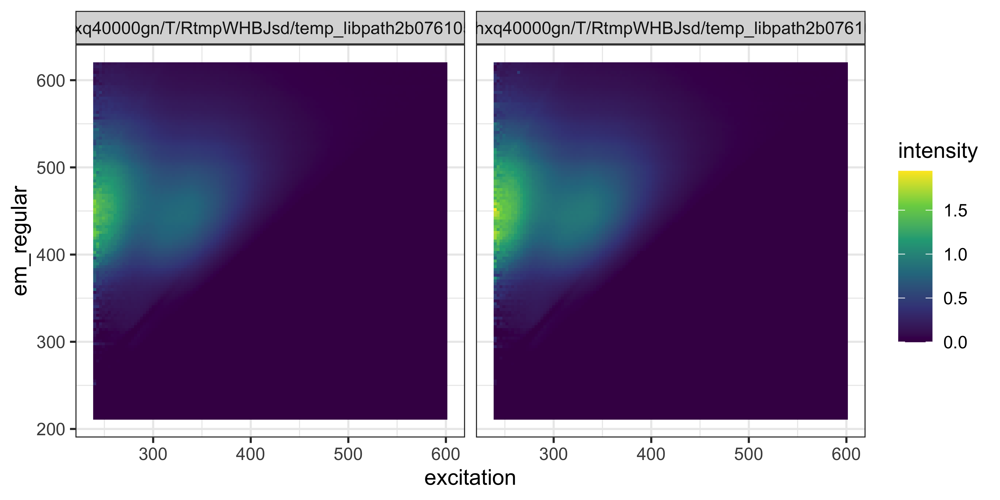
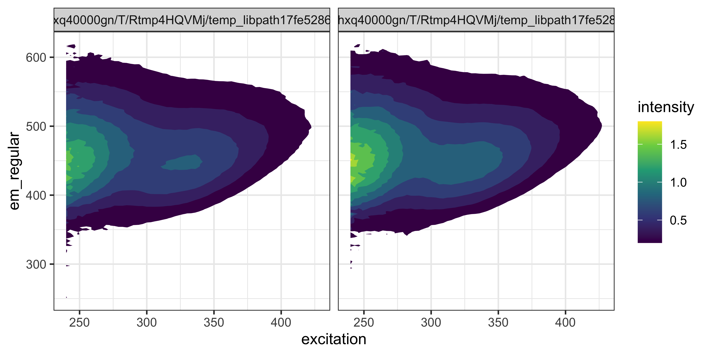

<!-- README.md is generated from README.Rmd. Please edit that file -->

# cwrshelpr

<!-- badges: start -->
<!-- badges: end -->

`cwrshelpr` provides a collection of functions for data analysis tasks
at Dalhousie University’s Centre for Water Resources Studies.

## Installation

You can install the development version from
[GitHub](https://github.com/) as follows. If the `remotes` package is
not installed, run `install.packages("remotes")` first. If you’re new to
R, [*R for data science*](https://r4ds.had.co.nz/) provides an excellent
introduction.

``` r
remotes::install_github("bentrueman/cwrshelpr")
```

The examples below rely on the `tidyverse` family of packages. Run
`install.packages("tidyverse")` if it’s not already installed.

## ICP-MS

To read and clean ICP-MS data files generated by the Thermo Scientific
iCAP-RQ, use the `read_icp()` function. (N.B., the code below uses
external raw data files as examples; replace them with your data.)

``` r
library("tidyverse")
library("cwrshelpr")
# example path to example raw data file
files <- list.files(
  # replace this line with the path to your data:
   path = system.file("extdata", package = "cwrshelpr"), 
   full.names = TRUE,
   pattern = ".+\\.xlsx"
)
read_icp(path = files[1]) # read and clean one file
#> # A tibble: 1,440 × 6
#>    sample_name estimate_type         isotope element    value unit 
#>    <chr>       <chr>                 <chr>   <chr>      <dbl> <chr>
#>  1 Wash        Concentration average 27      Al       0.115   µg/l 
#>  2 Wash        Concentration average 31      P       -0.0408  µg/l 
#>  3 Wash        Concentration average 45      Sc      99.6     %    
#>  4 Wash        Concentration average 55      Mn      -0.00621 µg/l 
#>  5 Wash        Concentration average 56      Fe       0.0124  µg/l 
#>  6 Wash        Concentration average 65      Cu       0.0396  µg/l 
#>  7 Wash        Concentration average 115     In      99.2     %    
#>  8 Wash        Concentration average 159     Tb      98.1     %    
#>  9 Wash        Concentration average 208     Pb       0.0497  µg/l 
#> 10 Wash        Concentration per Run 27      Al       0.133   µg/l 
#> # … with 1,430 more rows
files %>% 
  set_names() %>% 
  map_dfr(read_icp, .id = "file") # read and clean multiple files
#> # A tibble: 2,439 × 7
#>    file                sample_name estimate_type  isotope element    value unit 
#>    <chr>               <chr>       <chr>          <chr>   <chr>      <dbl> <chr>
#>  1 /private/var/folde… Wash        Concentration… 27      Al       0.115   µg/l 
#>  2 /private/var/folde… Wash        Concentration… 31      P       -0.0408  µg/l 
#>  3 /private/var/folde… Wash        Concentration… 45      Sc      99.6     %    
#>  4 /private/var/folde… Wash        Concentration… 55      Mn      -0.00621 µg/l 
#>  5 /private/var/folde… Wash        Concentration… 56      Fe       0.0124  µg/l 
#>  6 /private/var/folde… Wash        Concentration… 65      Cu       0.0396  µg/l 
#>  7 /private/var/folde… Wash        Concentration… 115     In      99.2     %    
#>  8 /private/var/folde… Wash        Concentration… 159     Tb      98.1     %    
#>  9 /private/var/folde… Wash        Concentration… 208     Pb       0.0497  µg/l 
#> 10 /private/var/folde… Wash        Concentration… 27      Al       0.133   µg/l 
#> # … with 2,429 more rows
```

## Fluorescence excitation-emission matrices (FEEM)

To read and clean FEEM data files generated by the Horiba Aqualog, use
the `read_feem()` function. The argument `truncate = TRUE` may be useful
if the corrected first order Rayleigh scattering line includes negative
intensities.

``` r
files <- list.files(
   path = system.file("extdata", package = "cwrshelpr"), # replace this line with the path to your data
   full.names = TRUE,
   pattern = ".+\\.csv"
)
read_feem(path = files[1]) # read and clean one file
#> # A tibble: 15,125 × 4
#>    emission em_regular excitation intensity
#>       <dbl>      <dbl>      <dbl>     <dbl>
#>  1     212.       212.        600         0
#>  2     212.       212.        597         0
#>  3     212.       212.        594         0
#>  4     212.       212.        591         0
#>  5     212.       212.        588         0
#>  6     212.       212.        585         0
#>  7     212.       212.        582         0
#>  8     212.       212.        579         0
#>  9     212.       212.        576         0
#> 10     212.       212.        573         0
#> # … with 15,115 more rows
feem_dat <- files %>% 
  set_names() %>% 
  map_dfr(~ read_feem(.x, truncate = TRUE), .id = "file") # read and clean multiple files
```

Plot FEEM data using the function `ggplot2::geom_raster()` (among
others). Use the column `em_regular` to avoid horizontal striping due to
irregular spacing of the `emission` wavelengths.

``` r
feem_dat %>% 
  ggplot(aes(excitation, em_regular, fill = intensity)) +
  facet_wrap(vars(file)) + 
  geom_raster() + 
  scale_fill_viridis_c()
```



Here is an example using `ggplot2::stat_contour(geom = "polygon")`:

``` r
feem_dat %>% 
  ggplot(aes(excitation, em_regular, z = intensity, fill = stat(level))) +
  facet_wrap(vars(file)) + 
  stat_contour(geom = "polygon") +
  scale_fill_viridis_c("intensity")
```



Integrate regions of the FEEM using `integrate_regions()`. This function
uses the regions defined in Chen et al. (2003) by default, but you can
supply your own as well.

``` r
feem_dat %>% 
  group_by(file) %>% 
  nest() %>% 
  ungroup() %>% 
  mutate(regions = map(data, integrate_regions)) %>% 
  unnest(regions)
#> # A tibble: 12 × 8
#>    file                   data      name  ex_min ex_max em_min em_max integrated
#>    <chr>                  <list>    <chr>  <dbl>  <dbl>  <dbl>  <dbl>      <dbl>
#>  1 /private/var/folders/… <tibble … regi…    200    250    250    330       46.6
#>  2 /private/var/folders/… <tibble … regi…    200    250    250    380      247. 
#>  3 /private/var/folders/… <tibble … regi…    200    250    250    550     2421. 
#>  4 /private/var/folders/… <tibble … regi…    250    340    340    380      745. 
#>  5 /private/var/folders/… <tibble … regi…    250    400    400    550    13312. 
#>  6 /private/var/folders/… <tibble … total     NA     NA     NA     NA    21597. 
#>  7 /private/var/folders/… <tibble … regi…    200    250    250    330       46.1
#>  8 /private/var/folders/… <tibble … regi…    200    250    250    380      261. 
#>  9 /private/var/folders/… <tibble … regi…    200    250    250    550     2687. 
#> 10 /private/var/folders/… <tibble … regi…    250    340    340    380      827. 
#> 11 /private/var/folders/… <tibble … regi…    250    400    400    550    14921. 
#> 12 /private/var/folders/… <tibble … total     NA     NA     NA     NA    24147.
```

The humification and biological indices of each FEEM, as described in
Tedetti et al. (2011), can be calculated using `calculate_indices()`:

``` r
feem_dat %>% 
  group_by(file) %>% 
  nest() %>% 
  ungroup() %>% 
  mutate(ix = map(data, calculate_indices)) %>% 
  unnest(ix)
#> # A tibble: 4 × 4
#>   file                                               data           param  value
#>   <chr>                                              <list>         <chr>  <dbl>
#> 1 /private/var/folders/fy/v4w9p72s7c996w8l8qfthxq40… <tibble [15,1… bix    0.517
#> 2 /private/var/folders/fy/v4w9p72s7c996w8l8qfthxq40… <tibble [15,1… hix   14.6  
#> 3 /private/var/folders/fy/v4w9p72s7c996w8l8qfthxq40… <tibble [15,1… bix    0.508
#> 4 /private/var/folders/fy/v4w9p72s7c996w8l8qfthxq40… <tibble [15,1… hix   13.6
```

## Additional resources

### Field flow fractionation data

Read, clean, and analyze field flow fractionation data using
`fffprocessr`, available
[here](https://github.com/bentrueman/fffprocessr).

### Coagulation modeling

An implementation of the Edwards (1997) model in R is available
[here](https://cran.r-project.org/web/packages/edwards97/index.html), or
via `install.packages("edwards97")`.

### Geochemical modeling

Dewey Dunnington’s `tidyphreeqc` (available
[here](https://github.com/paleolimbot/tidyphreeqc)) provides an
interface to PHREEQC in R, and `pbcusol` is designed specifically for
lead and copper solubility modeling (available
[here](https://github.com/bentrueman/pbcusol)).

# References

Chen, W., Westerhoff, P., Leenheer, J. A., & Booksh, K. (2003).
Fluorescence excitation−emission matrix regional integration to quantify
spectra for dissolved organic matter. Environmental science &
technology, 37(24), 5701-5710.

Edwards, M. (1997). Predicting DOC removal during enhanced coagulation.
Journal American Water Works Association, 89(5), 78-89.

Tedetti, M., Cuet, P., Guigue, C., & Goutx, M. (2011). Characterization
of dissolved organic matter in a coral reef ecosystem subjected to
anthropogenic pressures (La Réunion Island, Indian Ocean) using
multi-dimensional fluorescence spectroscopy. Science of the total
environment, 409(11), 2198-2210.
